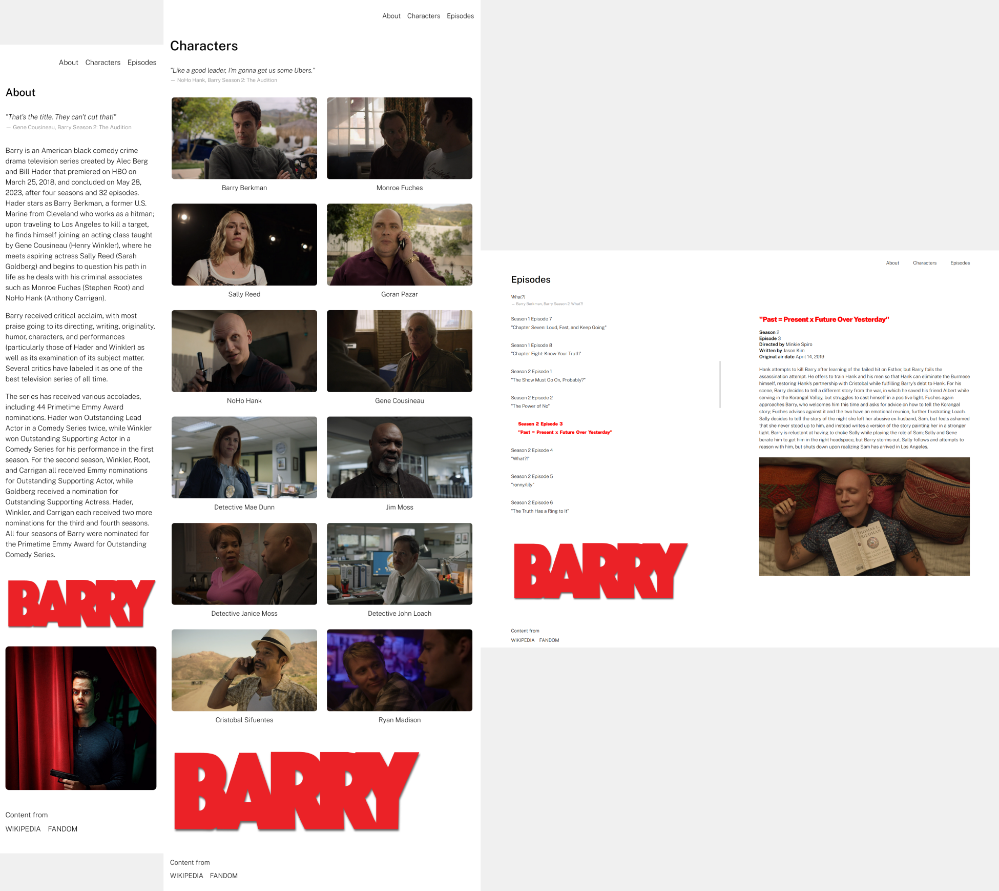

## Description

[View the Live Site!](https://barry-tv.vercel.app)

A responsive fan site dedicated to the dark comedy TV series Barry, showcasing information about the show, characters, and episodes. This project is a single-page application (SPA) built using React to provide an interactive and user-friendly experience for fans of the TV show Barry. Users can explore the "About" section, learn more about key characters, and browse through the list of episodes. The app is fully responsive, ensuring a smooth experience on mobile, tablet, and desktop devices.
- About: Learn more about the TV show Barry
- Characters: View the list of main characters with descriptions and additional details
- Episodes: Browse the list of episodes by season, including summaries and air dates

## Features
- Responsive Design: The website is fully responsive and adapts to different screen sizes, including mobile, tablet, and desktop views
- Single Page Application (SPA): The site utilizes React Router for seamless navigation without page reloads
- Hover Effects: Interactive hover effects for improved user experience
- Dynamic Content: Pages like "Characters" and "Episodes" dynamically display the data using React's useState and components
- Pages:
    About: General information about the show
    Characters: View the list of main characters with descriptions and additional details
    Episodes: Browse the list of episodes by season, including summaries and air dates

## Screenshots
Here are screenshots showcasing the website on various devices:

*from left to right: mobile, tablet, desktop*

## Technologies Used
- HTML: For structuring the content of the site
- CSS: For styling and making the site responsive
  - Media queries for responsive design
  - Flexbox for layout
- React.js: To build the user interface and manage state
  - useState hooks for managing component state
  - React Router for SPA routing between the "About", "Characters", and "Episodes" pages without page reloads
- JavaScript: Used for interactivity and DOM manipulation

## Acknowledgments
Sources for content and information:
* [Wikipedia - Barry (TV Series)](https://en.wikipedia.org/wiki/Barry_(TV_series))
* [Barry Wiki](https://barry-hbo.fandom.com/wiki/Barry_Wiki)
